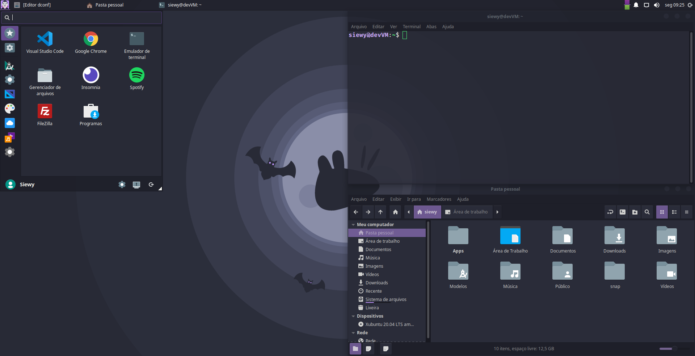

# DraculaMyXubuntu

Um *bash script* para fazer todas as instalações, configurações e desinstalações iniciais
no Xubuntu 20.04 para um ambiente de desenvolvimento leve.

Este código foi desenvolvido para sistemas recém-instalados.
Não nos responsabilizamos pelo sua execução em outras circunstâncias.

Para instalações individuais veja:
* [matheus-souza/backpack](https://github.com/matheus-souza/backpack)

## Remove
* Dicionário (xcfe4-dict)
* File Roller
* Firefox
* Gigolo
* GIMP
* GTK Settings
* Jogos
* LibreOffice
* Softwares para Impressoras
* Mousepad
* Notas (xfce4-notes)
* Reprodutor de mídia Parole
* Pidgin
* Protetor de Tela (xfce4-screensaver)
* Sobre mim (mugshot)
* Scanner de documentos (simple-scan)
* Thunderbird
* Transmission
* Visualizador de Documentos Atril
* Xfburn
* Yelp

## Instala
* Google Chrome
* Docker
* FileZilla
* Git
* Insomnia
* Nemo
* Node.js, Expo-CLI e Yarn
* PIP do Python
* PHP
* Spotify
* Snap
* VS Code
* ZSH, Oh My ZSH e Powerlevel10k

## Comandos (alias)
| Atalho | Comando | Atalho | Comando |
|----|---------|---|---|
| lll | ls -alF |
| gp | git push | new-react <pasta> | yarn create react-app |
| ga | git add | new-native <pasta> | yarn create react-native-app |
| gaa | git add -A | new-next <pasta> | yarn create next-app |
| gst | git status | new-express <pasta> | yarn init -y && yarn add express cors |
| gcl | git clone | new-koa <pasta> | yarn init -y && yarn add koa |
| gpa | git pull --all | new-expo <pasta> | expo init |
| gfa | git fetch --all |  |   |
| grv | git remote -v |  |   |
| gcm | git commit -m |  |   |
| gacm | git commit -am |  |   |
| gpor | git push --all origin |  |   |
| gpup | git pull --all upstream |   |   |
| gfup | git fetch --all upstream |   |   |
| grau | git remote add upstream |   |   |

Veja mais detalhes em .bash_alias e .bash_profile.

## Configurações manuais
* **VS Code:** Configure Settings Sync.
* **Insomnia:** Selecionar Dracula como tema.
* **Git:** Credênciais fornecidas serão salvas de maneira global.

## A fazer
[ ] Configurar tecla SUPER (Win)
[ ] Arrumar Ícone Insomnia
[ ] Definir como padrão no exo Chrome, Nemo e Gmail

## Execução
No terminal de sua preferência, execute a única linha abaixo. O sistema será **reiniciado** ao final.
O processo demora cerca de 30 minutos e diminui o uso de disco em aproximadamente 1GB.
```
cd ~/Downloads && wget -c https://github.com/FagnerJB/DraculaMyXubuntu/archive/master.zip -O ./DMXubuntu.zip && unzip -q ./DMXubuntu.zip && cd DraculaMyXubuntu-master && chmod +x ./run.sh && ./run.sh
```

## Links
* [Xubuntu](https://xubuntu.org/download/) - Baixar Xubuntu
* [VMware Player](https://www.vmware.com/products/workstation-player/workstation-player-evaluation.html) - Virtualizador recomendado
